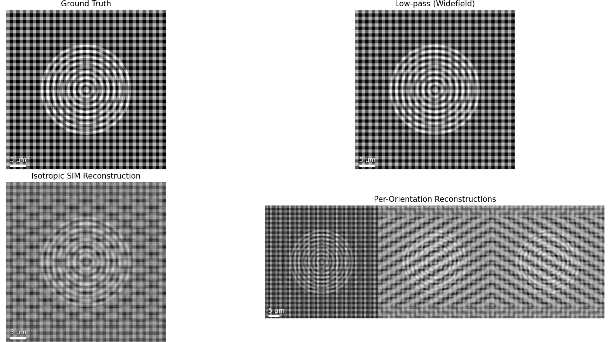

# 🧪 Structured Illumination Microscopy (SIM) Image Simulation  

This repository contains a **Python simulation of Structured Illumination Microscopy (SIM)**.  
The goal is to demonstrate the key concepts of SIM — how structured patterns shift high-frequency information into the passband, and how computational reconstruction recovers resolution beyond the diffraction limit.  

The simulation includes:  
- Generation of a synthetic ground truth object  
- Widefield (low-pass filtered) imaging  
- Structured illumination (multiple orientations & phases)  
- Fourier domain analysis (central + sidebands)  
- Reconstruction with subpixel Fourier shifting  
- Noise modeling (Gaussian & Poisson)  
- Wiener-like weighting for noise suppression  
- Final comparison of clean vs noisy reconstructions  
- Figures with automatic **scale bars**  

---

## ▶️ Usage
- Run the simulation:
- python main.py
- This will:

Generate a synthetic test object.

Perform SIM image simulation and reconstruction.

Display Fourier spectra, frequency components, and reconstructed images.

Show both clean and noisy reconstructions with scale bars.

---
## 📊 Example Outputs
### Ground Truth

### Low pass filter on GT

### Fourier Tranformation without Noise

###  Fourier Tranformation with Noise

### Phase pattern

### Frequency Component

### SIM Reconstructed without Noise

### SIM Reconstructed with Noise 

---
## 📖 Concepts Demonstrated
- Why multiple orientations and phases are required for isotropic resolution.

- How sidebands appear in Fourier space and why they must be shifted back.

- How subpixel Fourier shifts and Wiener filtering enable robust reconstruction.

- Effect of Gaussian (readout noise) and Poisson (shot noise) on image quality.

- Trade-off between resolution and signal-to-noise ratio in microscopy.

---
## ✨ Learning Outcomes
- Gained practical understanding of SIM principles.

- Learned how computational processing (Fourier analysis, Wiener filtering) enables super-resolution.

- Observed the robustness of SIM reconstruction under realistic noise conditions.

- Connected mathematical concepts (Fourier optics) to real microscopy applications.

---
